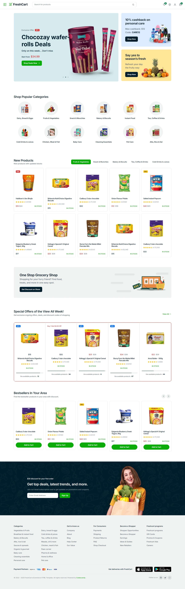

# 🛒 FreshCard — Modern E-Commerce Template (PHP + MySQL)

FreshCard adalah website e-commerce berbasis **PHP + MySQL** dengan tampilan modern, clean UI, dan struktur template profesional.  
Project ini mendukung sistem login customer, dashboard, dan integrasi database.

---

<h2>✨ Fitur Utama</h2>

### ⭐ Sistem Login Customer
- Form login modern  
- Validasi email & password  
- Redirect otomatis ke dashboard  

### ⭐ Dashboard Customer
- Ringkasan aktivitas belanja  
- Informasi profil  
- Tampilan clean & mobile responsive  

### ⭐ Koneksi Database (MySQL)
- Menggunakan file terpusat `config/database.php`  
- Mudah dipindahkan ke hosting, XAMPP, atau Laragon  

### ⭐ Template Modern Siap Kustomisasi
- Layout clean (FreshCart UI Style)  
- Component reusable  
- Struktur folder rapi & mudah dikembangkan  

---

<h2>🧩 Tech Stack</h2>

### **Backend**
- PHP 7+  
- MySQL  
- PDO / MySQLi  

### **Frontend**
- HTML5  
- CSS3  
- JavaScript (Vanilla)  
- Bootstrap (berdasarkan template)  

### **Tools**
- XAMPP / Laragon  
- phpMyAdmin  

---

<h2>📁 Struktur Folder (Ringkasan)</h2>

<pre>
FRESHCART/
├── assets/
│   ├── css/
│   ├── js/
│   └── images/
│
├── auth/
│   ├── login.php
│   ├── register.php
│   └── logout.php
│
├── config/
│   └── database.php
│
├── dashboard/
│   └── customer.php
│
├── pages/
│   ├── index.html
│   ├── shop-cart.html
│   ├── shop-single.html
│   ├── signin.php
│   └── signup.php
│
└── index.php

</pre>

---
<h2>📸 Preview UI</h2>

- Login	Dashboard	Profile

- Dashboard customer

- Dashboard Admin

<h2>🗺️ Roadmap</h2>
 Sistem keranjang belanja

 CRUD produk

 Checkout + pembayaran

 Multi role (admin, seller, customer)

 Manajemen pesanan

<h2>📝 Lisensi</h2>
MIT License — bebas digunakan dan dikembangkan.
